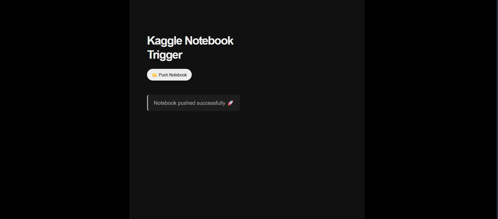

# Kaggle Notebook Trigger

Web app to push and run a Kaggle notebook from a local Next.js UI, with optional dynamic CSV input file selection and Google Drive read/write flow inside the notebook.



## Features

- Push Kaggle notebook from browser via API routes.
- Run notebook and fetch Kaggle kernel status.
- Optionally set a custom CSV file name before push.
- Uses a dedicated notebook for Google Drive operations:
    - Read a CSV.
    - Transform with pandas.
    - Upload processed CSV to a destination Drive folder.

## How it works

1. UI triggers Next.js API routes.
2. API routes call Kaggle CLI commands.
3. App always targets kaggle-notebook/read-and-write-to-google-drive.ipynb for push/run.
4. If custom file name is enabled, the backend updates the notebook line:
     - file_path = "..."
5. Kaggle executes the notebook, and the notebook handles Google Drive auth + file operations.

## Requirements

- Node.js 18+
- Python 3.10+
- Kaggle CLI installed and available on PATH
- Kaggle API token file

Install Kaggle CLI:

```bash
pip install kaggle
```

## Local setup

1. Clone and install dependencies:

```bash
git clone https://github.com/your-username/kaggle-trigger-app.git
cd kaggle-trigger-app
npm install
```

2. Add Kaggle credentials:

- Download kaggle.json from Kaggle account settings.
- Place file at:
    - Windows: C:\Users\<your-user>\.kaggle\kaggle.json
    - macOS/Linux: ~/.kaggle/kaggle.json

3. Start app:

```bash
npm run dev
```

4. Open http://localhost:3000

## Google Drive API usage in this notebook

This project notebook kaggle-notebook/read-and-write-to-google-drive.ipynb uses PyDrive2 (Google Drive API wrapper) to authenticate and then list/read/upload files.

### What the notebook does

1. Copies OAuth client credentials JSON from Kaggle input dataset to /kaggle/working/credentials.json.
2. Authenticates with GoogleAuth + CommandLineAuth.
3. Initializes a Drive client.
4. Reads source and destination Google Drive folder IDs.
5. Lists files in source folder.
6. Uses file_path (set in notebook, and optionally replaced by this app before push).
7. Reads CSV, updates data, writes a timestamped output CSV.
8. Uploads output CSV to destination folder.

### End-to-end setup for Google Drive API

1. Create Google Cloud project.
2. Enable Google Drive API.
3. Configure OAuth consent screen.
4. Create OAuth client credentials (Desktop app).
5. Download credentials JSON.
6. Upload credentials JSON to Kaggle as a private dataset.
7. Attach that dataset to your notebook so it appears under /kaggle/input/....
8. Update the credentials source path in the notebook copy step if your Kaggle dataset path differs.

Example path used in this notebook:

- /kaggle/input/datasets/satyatejachukka/google-drive-credentials/credentials.json

Notebook target copy path:

- /kaggle/working/credentials.json

### How authentication works in Kaggle

- The notebook calls gauth.CommandLineAuth().
- Kaggle output shows a URL.
- Open URL, sign in to Google account with Drive access.
- Paste verification code back into notebook prompt.
- Session then gets access token and can call Drive APIs through PyDrive2.

### Drive folder IDs

The notebook stores:

- source_folder_id
- destination_folder_id

To get folder ID from a Drive URL like:

- https://drive.google.com/drive/folders/14e4V2ApG3nZSMcLmNTFD6QZDFTcbumwT

Use the trailing part after folders/.

### Installing Drive dependencies in Kaggle (if needed)

If PyDrive2 is missing in your Kaggle runtime, add a notebook cell:

```python
!pip install -q pydrive2
```

## Using custom file name from this app

When custom file name is enabled in the UI:

- Backend updates the notebook assignment line that starts with:
    - file_path = ...
- Then pushes notebook to Kaggle.
- Notebook reads that CSV file name during execution.

Validation rules enforced by backend:

- File name is required.
- Name cannot include path separators (/ or \\).
- Name cannot include line breaks.

## API routes

- POST /api/pushKaggle
    - Pushes target notebook to Kaggle.
    - Optional: replaces file_path in notebook before push.

- POST /api/runKernel
    - Pushes notebook and returns current Kaggle kernel status.

- GET /api/kernelStatus
    - Returns current status of configured kernel.

## Key files

- lib/kaggleKernel.js
    - Shared Kaggle helpers, metadata handling, file name normalization, notebook update logic.

- pages/api/pushKaggle.js
    - Push endpoint.

- pages/api/runKernel.js
    - Push + status endpoint.

- pages/api/kernelStatus.js
    - Status endpoint.

- kaggle-notebook/read-and-write-to-google-drive.ipynb
    - Notebook that authenticates to Drive and performs CSV read/write/upload.

## Security notes

- Keep kaggle.json and Google credentials private.
- Use private Kaggle datasets for credentials.
- Never commit credentials to git.
- Rotate OAuth credentials if exposed.

## Troubleshooting

- kaggle.json not found:
    - Check location under user home .kaggle folder.

- Kaggle CLI not found:
    - Reinstall kaggle package and verify command on PATH.

- Google auth prompt fails:
    - Re-check OAuth consent + enabled Drive API.
    - Verify credentials JSON path copied in notebook.

- Upload fails:
    - Validate destination_folder_id and access permissions.

